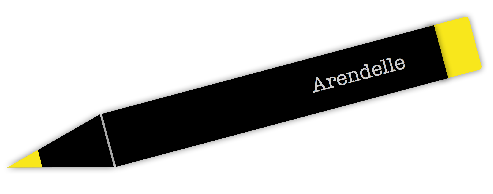

</img>
<h1>The Arendelle Book</h1>

Arendelle is a brand new language designed to help you create beautiful things while learning how to program. Arendelle is open source and free. We are a small company. We ask you to read this book and after you learned programming this way then you might teach three more people the same way you learned programming here by giving them this book and ask them to do the same. Hopefully, everyone will be able to enjoy coding. This is not a manual or a product but a book written with love for you and for the community you may one day be glad being a part of it!

&copy; Copyright 2015  <a href="http://kary.us">Pouya Kary</a>. All rights reserved.

