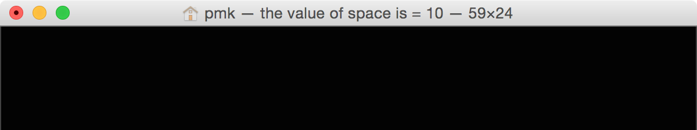

# Basic Calculator
Arendelle gives you tools for creating graphics but who said we can’t make other things with it? So very soon we will learn about **functions** and I want to show you a few tools Arendelle has. So to do it we will learn to create something like a calculator. We will learn to program it in some ways and we will learn how to use **stored spaces**. 

  
## Output of data
You know spaces. Have you ever imagined how to see what is in your spaces? Well, You can do things like this:

<!-- [+] Marker.js 1.14 : Code Block --> 

<pre>( space , 10 )  [ @space , pr ]</pre>

<!-- [-] Marker.js 1.14 : Code Block --> 

But it’s very ridiculous right? No problem! Do you remember the title changing I showed you at the very first stage? Yes… That!
When you wanted to change the screen’s title you used two of this `'` symbols like this :

<!-- CLIFF HIGHLIGHTER 0.01 DEV GENERATED CODE BLOCK--> 

<pre style="font-family: Monospace;">
'Something cool...'</pre>

<!-- CLIFF HIGHLIGHTER 0.01 DEV GENERATED CODE BLOCK--> 

And then you could see your title changing to `Something cool…`. Now, you can also show people the result of something within your title. How? You can write your space in the middle of the title code and then see it’s results there… What am I talking about? Look at this code:

<!-- [+] Marker.js 1.14 : Code Block --> 

<pre>( space , 10 ) 'the value of space is = | @space |'</pre>

<!-- [-] Marker.js 1.14 : Code Block --> 

So the title you get should be something like this:

 

</img>

 

But something very cool is what you’ll get is actually something like this:

 

</img>

 

So what we expected to be `the value of space is = | @space |` turned out to be `the value of space is = 10`. Arendelle reads the title’s text and then replaces the spaces with their numbers. Furthermore, this feature also works with sources, functions and stored spaces (we talk about stored spaces and functions soon) and actually any mathematical expression like `'| 2*3+1 |'` which will give you the title `7`  

#### Exercise
Imagine your going to show your user the size of the screen. What code you write to perform this operation?

 

  
## Using that idea to create a calculator!
So it’s too obvious now, isn´t it? To write a calculator all you need is to write a space, put your operations inside it and then use the title to display your result. So for example try this one:

<!-- [+] Marker.js 1.14 : Code Block --> 

<pre>( space , 2 * 4 ) '= | @space |'</pre>

<!-- [-] Marker.js 1.14 : Code Block --> 

Now you have learned how to show the value of a space in your app. Using the spaces in titles and that very simple calculators we’re going to learn functions and stored spaces.  

So the only question is … Are you ready!? Let’s do this!
