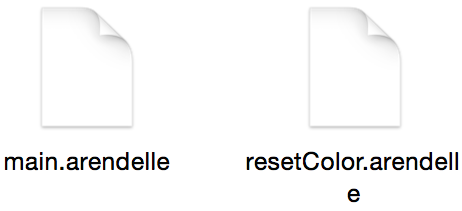
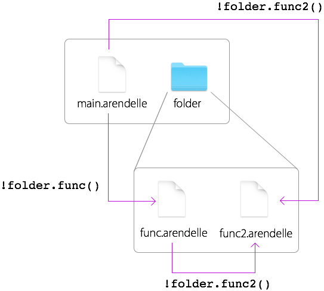
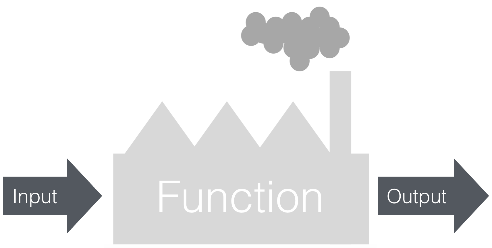

# Functions
One thing that made programming “Programming” was function. A function is a system. They are something like devices or tools which you create to do a specific task. For example hammer is a system and it’s function is to put a huge force to a special location. A pencil is a system that we have created to do the writing function.

In programming functions are so much like what I just told you! For example, all the commands we have in Arendelle such as `p`, `r`, `d`, `w`… all of them, they are functions too. For example, `p` is a system that does the painting function for us. We use it to paint the current dot.

You write the code for a specific job and then you use that code for the rest of your life without writing it over and over.

Think of it as something like this: I have a command that resets the location of my pointer and we all know it’s `i`. But there is no command to reset the color. So when I need to reset both color and location for many times. What should I do? For resetting the color I have this code:

<!-- CLIFF HIGHLIGHTER 0.01 DEV GENERATED CODE BLOCK--> 

<pre style="font-family: Monospace;">
[&nbsp;#n&nbsp;>&nbsp;0&nbsp;,&nbsp;n&nbsp;]&nbsp;</pre>

<!-- CLIFF HIGHLIGHTER 0.01 DEV GENERATED CODE BLOCK--> 

It’s a code that research imagine you have to use this 20 lines of code in 30 different place of your code! Imagine even worse! You need to change this 20 line code that you have putted in 30 place of your code once in a hour! This is when you see you really need help!

That’s why we have functions. Functions are blocks of codes, a bunch of codes that you give a special name so you can write them once and use them as much as you want.

So like everything else functions are things starting with something! Like the sources that started with `#` and the spaces that prepended with `@`, functions got a `!` in their start! But they also got an `()` in their end. So a function is something like this:

<!-- CLIFF HIGHLIGHTER 0.01 DEV GENERATED CODE BLOCK--> 

<pre style="font-family: Monospace;">
!function()</pre>

<!-- CLIFF HIGHLIGHTER 0.01 DEV GENERATED CODE BLOCK--> 

You can also write spaces after the function’s name and the parenthesis. So something like this is accepted:

<!-- CLIFF HIGHLIGHTER 0.01 DEV GENERATED CODE BLOCK--> 

<pre style="font-family: Monospace;">
!function&nbsp;&nbsp;&nbsp;&nbsp;(&nbsp;&nbsp;&nbsp;&nbsp;&nbsp;)</pre>

<!-- CLIFF HIGHLIGHTER 0.01 DEV GENERATED CODE BLOCK--> 

We learn what `()` is for in this very chapter so calm down! Let’s continue with somethings first: Let’s see how we can build a function! 

Functions are files. You know that you put your codes in a file with appended with `.arendelle` file format. We write functions into a file too. As you know from the past chapter. We then use **Arendelle File System**’s way of addressing to locate them.

A function starts with `< >` in it’s top. We call `< >` function header. and then we write our code and then we save them in a `.arendelle` file as well so look at this example:

We have this code:

<!-- CLIFF HIGHLIGHTER 0.01 DEV GENERATED CODE BLOCK--> 

<pre style="font-family: Monospace;">
[&nbsp;#rnd&nbsp;*&nbsp;10&nbsp;,&nbsp;n&nbsp;]  !resetColor&nbsp;()  [&nbsp;5&nbsp;,  &nbsp;&nbsp;&nbsp;[&nbsp;4&nbsp;,&nbsp;pr&nbsp;] &nbsp;&nbsp;&nbsp;[&nbsp;4&nbsp;,&nbsp;l&nbsp;] &nbsp;&nbsp;&nbsp;dn  ]  !resetColor&nbsp;()  [&nbsp;4&nbsp;,&nbsp;pr&nbsp;]</pre>

<!-- CLIFF HIGHLIGHTER 0.01 DEV GENERATED CODE BLOCK--> 

Then we save it on a file called `main.arendelle`:

 
</img>
 

Now we need to write the `!resetColor ()` function. But how can we write it? Simply we first need to create a file and call and it `resetColor.arendelle` If you’re using one of our Arendelle official IDE’s ( so called studio ) you have a function bar which you can add functions in them simply by clicking on the add function button. However we put the following code in our function file:

<!-- CLIFF HIGHLIGHTER 0.01 DEV GENERATED CODE BLOCK--> 

<pre style="font-family: Monospace;">
<&nbsp;> [&nbsp;#n&nbsp;>&nbsp;0&nbsp;,&nbsp;n&nbsp;]</pre>

<!-- CLIFF HIGHLIGHTER 0.01 DEV GENERATED CODE BLOCK--> 

Now you should have something as the following:

 
</img>
 

So as you seen it, a function is another code that your code calls when it needs it. Like the **Stored Spaces** you have the Arendelle’s File Manager system here. You can write:

<!-- CLIFF HIGHLIGHTER 0.01 DEV GENERATED CODE BLOCK--> 

<pre style="font-family: Monospace;">
!folder.function&nbsp;()</pre>

<!-- CLIFF HIGHLIGHTER 0.01 DEV GENERATED CODE BLOCK--> 

This is possible by creating a folder named `folder` and then put the `function.arendelle` file in it.

  
## More specifics about Arendelle File System's Path and Addressing in Functions or in short “A Note!”

In any possible Arendelle code you run one file first. This file’s folder will be the **root** directory for the rest of the apps. Okay the fact is each file will be addressed comparing the main function (or what you may call main file). So for example if you create a main file and then you create a folder with two functions names `func` and `func2` you will have something like this:

</img>

 

Now as you see in the images each file has it’s own address based on the `main.arendelle`. So it doesn’t matter if you want to call `func2` from the `main.arendelle` or the `func.arendelle`. It’s address is `!folder.func2 ()` even if you try to access it from itself you have to use `!folder.func2()` So now you know every single tiny tricky mysterious thing about **Arendelle File System’s File Addressing**

  
## Function I/0

As you know a function is being written in another file, somewhere else and not in our main blueprint. So now you ask yourself: How can I tell something to that other files? I mean look at a function as a factory. A factory has an **Input** and an **Output**. 

**Input** is the things the factory buys and uses to create it’s products and **Output** is the products. For example in the fork factory they buy metal as *input* an you change it to the a fork as *output*. But actually in the computers functions operate on **informations**: You give them some info and they use them to do stuff.

</img>

 

In the real world a factory always need input and output because without input how could a factory build something? A fork from air? And with no output there is no profit. So every single real world factory has come with this two attributes. Computer functions however are different. You do not have to have input but you can if you want. Look the first function we created:

<!-- CLIFF HIGHLIGHTER 0.01 DEV GENERATED CODE BLOCK--> 

<pre style="font-family: Monospace;">
<&nbsp;> [&nbsp;#n&nbsp;>&nbsp;0&nbsp;,&nbsp;n&nbsp;]</pre>

<!-- CLIFF HIGHLIGHTER 0.01 DEV GENERATED CODE BLOCK--> 

It just changes the value of `#n` - nothing more. But there are some functions with input and output. For example: How you calculate the square root of a number like 125? You use this code:

<!-- CLIFF HIGHLIGHTER 0.01 DEV GENERATED CODE BLOCK--> 

<pre style="font-family: Monospace;">
(&nbsp;root&nbsp;,&nbsp;sqrt&nbsp;(125)&nbsp;)&nbsp;</pre>

<!-- CLIFF HIGHLIGHTER 0.01 DEV GENERATED CODE BLOCK--> 

Now, if you look `sqrt` is a function. I told you I show you what `( … )` is in the last of the function name and now I tell you. Its the input. You write the input/inputs between this two parentheses like when you enter `125` as input of sqrt. Entering  a number to input in programming is called **Passing**. For example here I have passed 125 to the sqrt and as you see. The whole `sqrt(125)` is the output. Because if you look:

<!-- CLIFF HIGHLIGHTER 0.01 DEV GENERATED CODE BLOCK--> 

<pre style="font-family: Monospace;">
(&nbsp;root&nbsp;,&nbsp;sqrt&nbsp;(125)&nbsp;)&nbsp;</pre>

<!-- CLIFF HIGHLIGHTER 0.01 DEV GENERATED CODE BLOCK--> 

When Arendelle reads this and finds the `sqrt(125)`, it replaces the `sqrt(125)` with its result which is `11.18033988749895`. So if like before when you wrote:

<!-- ARENDELLE CODE BLOCK -->

#source  + 2 / @space  + $storedSpace  
   
 

 
<!-- ARENDELLE CODE BLOCK -->

Functions work exactly the same. But you may ask how to create input and output for our functions in Arendelle?

For the input: You know that you have to write those two `<` and `>` in the beginning of your function code right? We use them for a simple fact. We write what inputs we want. For example let’s write a function that draws us a line in the given size, Something like:

<!-- CLIFF HIGHLIGHTER 0.01 DEV GENERATED CODE BLOCK--> 

!drawLine()

<!-- CLIFF HIGHLIGHTER 0.01 DEV GENERATED CODE BLOCK--> 

So when you use it, it be like:

<!-- CLIFF HIGHLIGHTER 0.01 DEV GENERATED CODE BLOCK--> 

!drawLine(10)

<!-- CLIFF HIGHLIGHTER 0.01 DEV GENERATED CODE BLOCK--> 

And it will draw you a line in the size of 10. But how? You know that you pass a number to the function right? The thing is you have to name this number in your function and save it as a space. So when someone passes a number, Arendelle save that number in a space for you and you be able to access it in the function. To do this, You have to name your input, How? You just have to write the name between the `< … >`. So if we start to write the `drawLine.arendelle` the code will be like:

<!-- CLIFF HIGHLIGHTER 0.01 DEV GENERATED CODE BLOCK--> 

<pre style="font-family: Monospace;">
<&nbsp;size&nbsp;> [&nbsp;@size&nbsp;,&nbsp;pr&nbsp;]</pre>

<!-- CLIFF HIGHLIGHTER 0.01 DEV GENERATED CODE BLOCK--> 

Now if you write `!drawLine ( 10 )` and Arendelle reads the function, it will create a space names `@size` with the value of `10`. When it gets to the `[ @size , pr ]` it will draw a line in size of 10. If you also write a code like this:

<!-- CLIFF HIGHLIGHTER 0.01 DEV GENERATED CODE BLOCK--> 

<pre style="font-family: Monospace;">
(&nbsp;space&nbsp;,&nbsp;1&nbsp;)  [&nbsp;3&nbsp;,  &nbsp;&nbsp;&nbsp;!drawLine&nbsp;(&nbsp;@space&nbsp;)&nbsp;d &nbsp;&nbsp;&nbsp;(&nbsp;space&nbsp;,&nbsp;+&nbsp;1&nbsp;)  ]</pre>

<!-- CLIFF HIGHLIGHTER 0.01 DEV GENERATED CODE BLOCK--> 

As you can see you get this image:

 

 

If you look at the code you see that in the look actually we have `!drawLine()` evaluated for 3 times like this:

<!-- CLIFF HIGHLIGHTER 0.01 DEV GENERATED CODE BLOCK--> 

!drawLine(1) 
!drawLine(2) 
!drawLine(3)

<!-- CLIFF HIGHLIGHTER 0.01 DEV GENERATED CODE BLOCK--> 

And if you look at the code of drawLine in this 3 times you see this:

**First Time**

<!-- CLIFF HIGHLIGHTER 0.01 DEV GENERATED CODE BLOCK--> 

<pre style="font-family: Monospace;">
<&nbsp;size&nbsp;>&nbsp;//&nbsp;@size&nbsp;is&nbsp;1 [&nbsp;1&nbsp;,&nbsp;pr&nbsp;]</pre>

<!-- CLIFF HIGHLIGHTER 0.01 DEV GENERATED CODE BLOCK--> 

**Second Time**

<!-- CLIFF HIGHLIGHTER 0.01 DEV GENERATED CODE BLOCK--> 

<pre style="font-family: Monospace;">
<&nbsp;size&nbsp;>&nbsp;//&nbsp;@size&nbsp;is&nbsp;2 [&nbsp;2&nbsp;,&nbsp;pr&nbsp;] </pre>

<!-- CLIFF HIGHLIGHTER 0.01 DEV GENERATED CODE BLOCK--> 

**Third Time**

<!-- CLIFF HIGHLIGHTER 0.02 DEV GENERATED CODE BLOCK--> 

<pre style="font-family: Monospace;">
<&nbsp;size&nbsp;>&nbsp;//&nbsp;@size&nbsp;is&nbsp;3 [&nbsp;3&nbsp;,&nbsp;pr&nbsp;]</pre>

<!-- CLIFF HIGHLIGHTER 0.02 DEV GENERATED CODE BLOCK--> 

  
## More than one input
To pass more than one input to a function you have first know how does a function with more than one input looks like? Well, its too easy. We separate the inputs with “,” like this function that calculates a power of a number:

<!-- CLIFF HIGHLIGHTER 0.01 DEV GENERATED CODE BLOCK--> 

!pow&nbsp;(&nbsp;number&nbsp;,&nbsp;power&nbsp;)

<!-- CLIFF HIGHLIGHTER 0.01 DEV GENERATED CODE BLOCK--> 

And to implement more than one input in the function’s blueprint we will write our `pow.arendelle` function header like this:

<!-- CLIFF HIGHLIGHTER 0.01 DEV GENERATED CODE BLOCK--> 

<&nbsp;number&nbsp;,&nbsp;power&nbsp;>

<!-- CLIFF HIGHLIGHTER 0.01 DEV GENERATED CODE BLOCK--> 

*But how to implement the output…?*

  
## Output
Well output is the easiest part of the language! In Arendelle functions there’s one special space which Arendelle creates before it even starts to create the function itself (this creating thing in programming is called **Init** as its a short for initialization). This space is called **return**. If you look at it in a function you see that it has the value of zero and is inited. Return is one holy, special space. And actually the only holy space. You can’t create it, You can’t remove it. Only if you have it, you can change it’s values! But when the work of a function finishes, Arendelle reads the value of `@return` uses it as the output or shall we say **Result** of the function. So now let’s write the full `!pow(number, power)`:

<!-- CLIFF HIGHLIGHTER 0.02 DEV GENERATED CODE BLOCK--> 

<pre style="font-family: Monospace;">
<&nbsp;number&nbsp;,&nbsp;power&nbsp;> (&nbsp;return&nbsp;,&nbsp;@number&nbsp;^&nbsp;@power&nbsp;)</pre>

<!-- CLIFF HIGHLIGHTER 0.02 DEV GENERATED CODE BLOCK--> 

So you see, it’s very simple! All you have to do is to put your result into the `@return` space.

Now that you have your `!pow()` function, you can use it anywhere. Something cool is you get to use it in anywhere! Yes as you know before now you could only use sources in mathematical expressions and you could never could use commands in the mathematical expressions. However you can use function beside commands like:

<!-- CLIFF HIGHLIGHTER 0.02 DEV GENERATED CODE BLOCK--> 

<pre style="font-family: Monospace;">
[&nbsp;10&nbsp;,&nbsp;pd&nbsp;]&nbsp;!drawLine(&nbsp;10&nbsp;)&nbsp;[&nbsp;10&nbsp;,&nbsp;pu&nbsp;]</pre>

<!-- CLIFF HIGHLIGHTER 0.02 DEV GENERATED CODE BLOCK--> 

But you also can use it in mathematical expressions. However, this time Arendelle will use functions as something like sources and spaces. So as before, it evaluates functions. But like the sources and spaces it will replace it with the value of `@return`. Now you want to have a line in size of 2 to the power of 4? Simply:

<!-- CLIFF HIGHLIGHTER 0.02 DEV GENERATED CODE BLOCK--> 

<pre style="font-family: Monospace;">
[&nbsp;!pow&nbsp;(&nbsp;2&nbsp;,&nbsp;4&nbsp;)&nbsp;,&nbsp;pr&nbsp;]</pre>

<!-- CLIFF HIGHLIGHTER 0.02 DEV GENERATED CODE BLOCK--> 

  

<h4>Exercise</h4>
Write a function like this:

<!-- CLIFF HIGHLIGHTER 0.01 DEV GENERATED CODE BLOCK--> 

<pre style="font-family: Monospace;">
!yourAgeInDays&nbsp;(&nbsp;years&nbsp;,&nbsp;months&nbsp;,&nbsp;days&nbsp;)</pre>

<!-- CLIFF HIGHLIGHTER 0.01 DEV GENERATED CODE BLOCK-->

