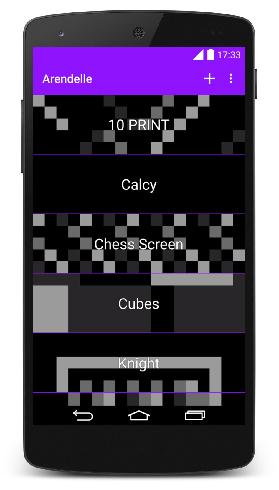
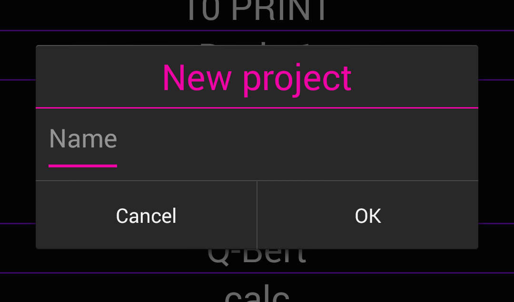
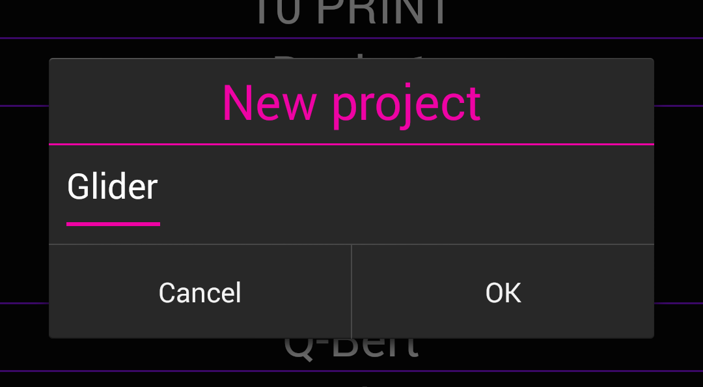
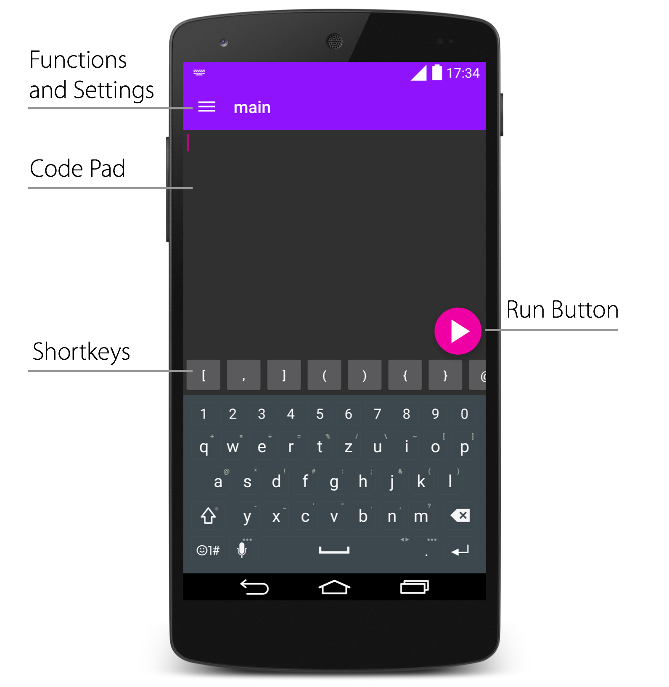
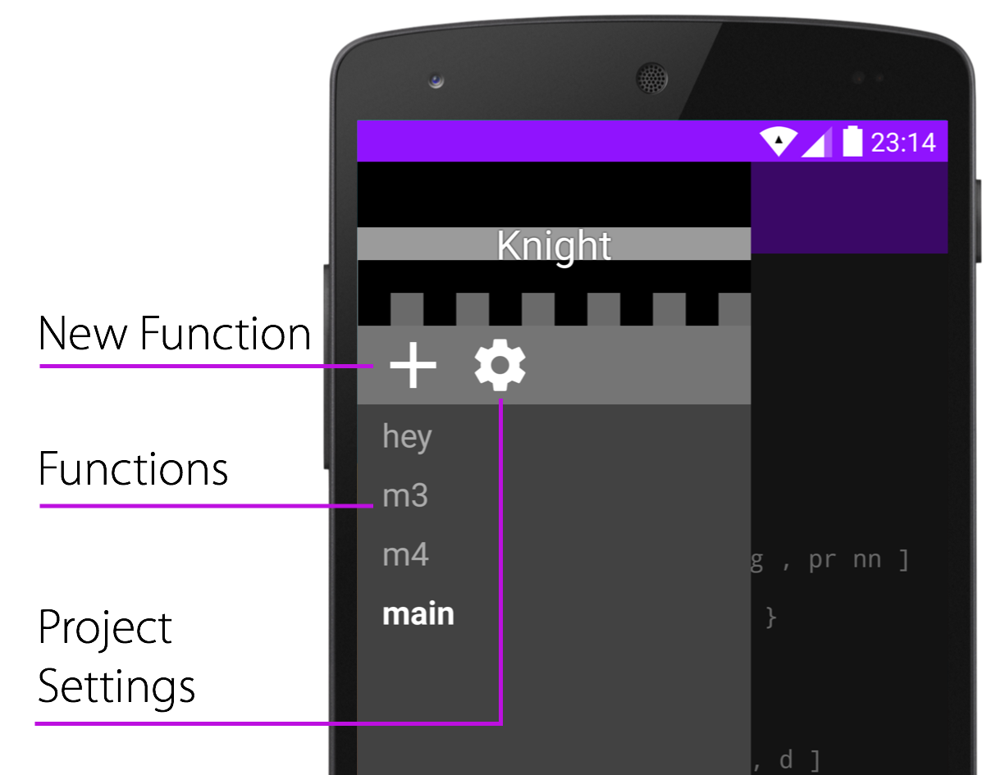
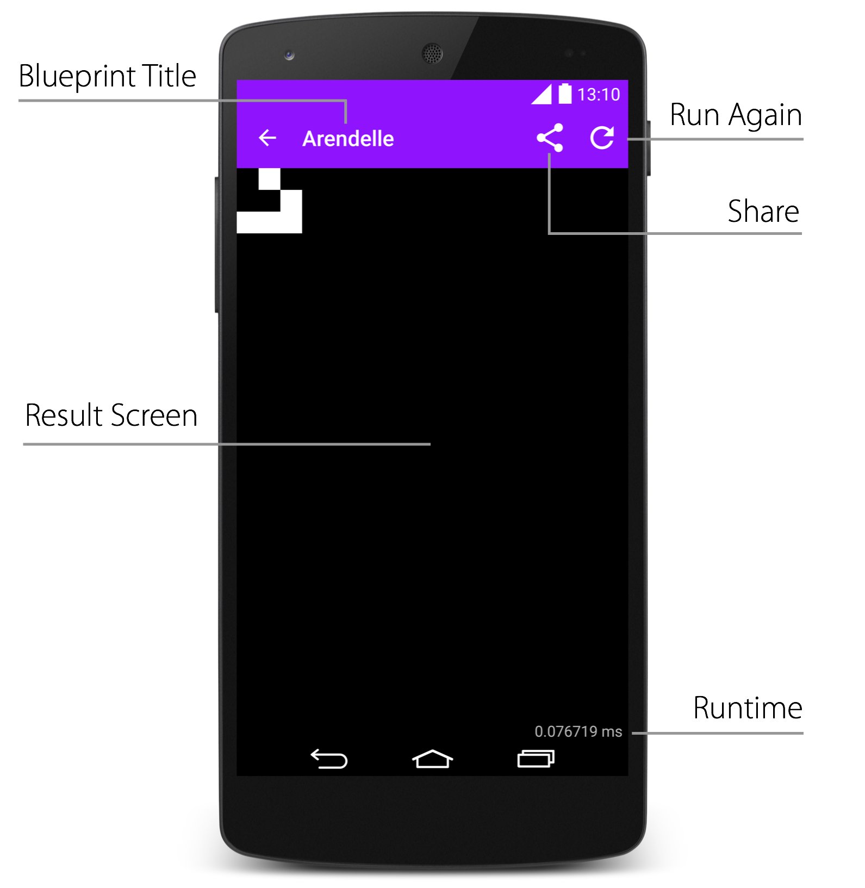
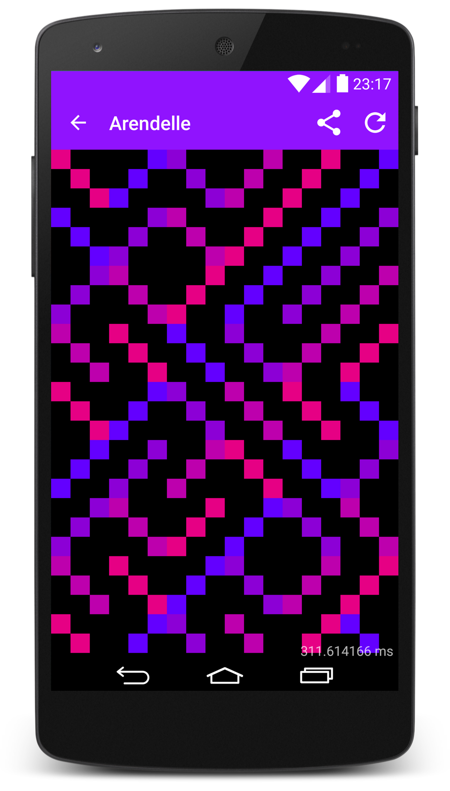

# Arendelle Android

Our Android app is a full featured Arendelle studio ready for any device running Android 4 and later. It’s a very gorgeously looking app shipped with Google’s latest “Material Design” Interface components and standards based on JArendelle. Arendelle’s fastest engine (by now)! So if you have an Android device download it now from Google Play Store!  

</img>

 

When you download Arendelle on your Android phone for the first time you see this “Welcome” page. If you read the page you’ll learn the five basic commands which we will also cover in this book. However, after this page you will get into the gallery. The gallery is the list of your projects like this:

</img>

 

In this screen you can view and manage all your Arendelle projects. In the bar of this page you have two buttons.

By tapping on the **plus** button you can create a new project. To create a project you have to name two things. **Project’s Name** and **Project’s Main Function**:

 

</img>

 

So let’s create a new project and call it “Glider”. (Functions are somethings we learn in the last chapters of this book. So don’t think about them and for now just fill the **Main Function** same as the project name or like me just fill it with “main”):

 

</img>

 

When you created a project you will get into the **Editor** which is where you edit your codes. Editor has some tools like this:

</img>

 

All the tools you may need to edit your code is here in Editor. In the title bar you can see the name of the function you’re editing which is not really important right now! The pretty pink colored “Run Button” starts to run your codes.

Something that is super helpful when you’re coding is the “Shortkey Bar”. Arendelle codes are full of special-characters like `[` , `,` and `]` which you use the most. We have all of them sorted by how much they are used in the Shortkey bar. You can scroll it to see all the characters you have there.

Something else in Editor is the drawer menu that has all the Functions and Project Settings on it like this:  

</img>

 

In the **Project Settings** page you can choose the main function which we will talk later about but also you get to choose the color plate you want for your code. You will learn that Arendelle codes are based on four colors and a background. You can choose color themes for that there. So When you write a code like `rprdpdplplp` as you learned in the welcome of Arendelle you see a page called **Result Screen** which looks like this: 

</img>

 

In Arendelle you can change titles. In Android it’s possible. You can change the Blueprint’s title anytime with a command you’ll learn soon. The **Result Screen** also comes with some tools. One is **Runtime**. It’s a number in **milliseconds** which tells you how long it does take to run your blueprint. It’s a very very important tool to write Arendelle codes. You always have to write code in a way that your code run as fast as possible.

We also have two buttons in the bar. One is for sharing your result which reports your result to a kind and happy PNG picture and then shows you a list of application which you can share your result on them. The other button is the **Run Again** button which you can use to re-run your Arendelle blueprint. It’s handy when you write random based codes which each time you run you get another result. That’s all with Arendelle Android! You’re now a master in knowing everything about it! You can do so much amazing things on this app. Look at this for example:  

</img>

 

