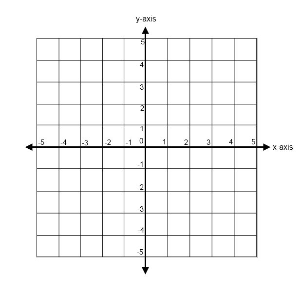

# Creating a Graph Engine
## What you need before you start?
Its simple: To create a graph engine you first need to know what a graph is! As I have created this book for everyone from every ages I suggest if you’re going to teach this book to children with no idea of what a graph or you have studied art and you don’t know what a graph is then just skip this part because learning graphs needs time and you should know equations of basic shapes. If you can put sometime to learn graphs and diagrams then come back and then try this codes, you will be all right without them in the next chapters.

  
## Creating a basic graph

To create a graph engine we first need to understand the true nature of graphs. We first need to talk a bit of lines in the computer. In the mathematics we know lines as a sequence of infinity points. But in the computers we know them as a sequence of pixels, also math says there is an infinity points between two other points but in the computers we know that there are always some pixels between two pixels. 

And knowing this is very awesome for us, we can do something in computers that is nearly impossible in the math. Asking what is that? Lets see.

  
## Math’s points. Arendelle’s dots

As you know to create a graph from an equation you need to check each point of the graph and see if it’s in the equation or not. As no one is can’t actually do this people find special parts in the graph and then by checking some very special parts of the graph and then when they finds the pattern they start creating the curve. 

However in the computer we have a limited number of pixels so we can check out each of them and see if they are in the equation. This makes your system to do so much work but at last its good because it let’s us actually create this thing. 

We have to give each dot a number for x and y coordination like the graph screen and if you look at it right it’s actually just like that, Look at this graph grid:

</img>

And now look at Arendelle’s grid

 
</img>

 

So as you see we have make a way to move our origin the center of the screen instead of making it the center of everything. So in the standard system the inception dot is the dot with `#x` and `#y` of zero but in our new system the origin is not the inception dot so we the inception dot’s number should be `#x` of minus half of the `#i` and `#y` with the value of minus half of the `#j`. So we cannot change `#x` and `#y` that’s why we have to write `#i / 2 - #x` and `#j / 2 - #y` instead of them!

  
## Creating the system!
So how do we do this? Its very simple! For starter we have to create something to paint all the dots in the page. Look at this:

<!-- CLIFF HIGHLIGHTER 0.01 DEV GENERATED CODE BLOCK-->

<pre style="font-family: Monospace;">
[&nbsp;#j&nbsp;,  &nbsp;&nbsp;&nbsp;&nbsp;[&nbsp;#i&nbsp;,&nbsp;pr&nbsp;]&nbsp; &nbsp;&nbsp;&nbsp;&nbsp;[&nbsp;#i&nbsp;,&nbsp;l&nbsp;]&nbsp; &nbsp;&nbsp;&nbsp;&nbsp;d &nbsp;&nbsp;&nbsp; ]&nbsp;</pre>

<!-- CLIFF HIGHLIGHTER 0.01 DEV GENERATED CODE BLOCK-->

Now we are going to create something that only fills the dots in the equation. Our first equation is simple and we’re no going to assume center of the page as origin. The inception dot will be our origin like it is in default and our equation is `x + y < 10`. Now you may ask how to do that? Its easy! All you have to do is to replace the `p` from the preview code with this condition:

{ #x + #y < 10 , p } 
 

So as you see this condition powers us to only color the dot in our equation. Look! This is your simple graphing system:

<!-- CLIFF HIGHLIGHTER 0.01 DEV GENERATED CODE BLOCK-->

<pre style="font-family: Monospace;">
[&nbsp;#j&nbsp;,  &nbsp;&nbsp;&nbsp;&nbsp;[&nbsp;#i&nbsp;, &nbsp;&nbsp;&nbsp;&nbsp; &nbsp;&nbsp;&nbsp;&nbsp;&nbsp;&nbsp;&nbsp;{&nbsp;#x&nbsp;+&nbsp;#y&nbsp;<&nbsp;10&nbsp;,&nbsp;p&nbsp;}&nbsp; &nbsp;&nbsp;&nbsp;&nbsp;&nbsp;&nbsp;&nbsp;r &nbsp;&nbsp;&nbsp;&nbsp;&nbsp;&nbsp; &nbsp;&nbsp;&nbsp;&nbsp;]&nbsp; &nbsp;&nbsp;&nbsp;&nbsp;[&nbsp;#i&nbsp;,&nbsp;l&nbsp;]&nbsp; &nbsp;&nbsp;&nbsp;&nbsp;d &nbsp;&nbsp;&nbsp; ]&nbsp;</pre>

<!-- CLIFF HIGHLIGHTER 0.01 DEV GENERATED CODE BLOCK-->

The code you see will generate this:

 

 

  

<h4>Exercise</h4>
Create a simple graph engine to draw a rectangle

  

  
## Origin at center
I started talking about origins a few lines ago and now we’re going to use them! We are going to create a circle! You may know that the equation for circles are `x^2 + y^2 = r^2`. Now as I want the circle to be filled I need to select inside it too and that’s why I will use `<=` as `=` in the original equation. Look at this code:

<!-- CLIFF HIGHLIGHTER 0.01 DEV GENERATED CODE BLOCK-->

<pre style="font-family: Monospace;">
[&nbsp;#j&nbsp;,  &nbsp;&nbsp;&nbsp;&nbsp;[&nbsp;#i&nbsp;, &nbsp;&nbsp;&nbsp;&nbsp; &nbsp;&nbsp;&nbsp;&nbsp;&nbsp;&nbsp;&nbsp;{&nbsp;#x^2&nbsp;+&nbsp;#y^2&nbsp;<&nbsp;300&nbsp;,&nbsp;p&nbsp;}&nbsp; &nbsp;&nbsp;&nbsp;&nbsp;&nbsp;&nbsp;&nbsp;r &nbsp;&nbsp;&nbsp;&nbsp;&nbsp;&nbsp; &nbsp;&nbsp;&nbsp;&nbsp;]&nbsp; &nbsp;&nbsp;&nbsp;&nbsp;[&nbsp;#i&nbsp;,&nbsp;l&nbsp;]&nbsp; &nbsp;&nbsp;&nbsp;&nbsp;d &nbsp;&nbsp;&nbsp; ]&nbsp; </pre>

<!-- CLIFF HIGHLIGHTER 0.01 DEV GENERATED CODE BLOCK-->
 

This code will render a 1/4 of a circle like this:

 

 

Now we have to take everything to the next level, We have to use that pieces we talk about earlier, so we have to replace `#x` with `#i / 2 - #x` and `#y` with `#j / 2 - #y`, Look at this code now:

<!-- CLIFF HIGHLIGHTER 0.01 DEV GENERATED CODE BLOCK-->

<pre style="font-family: Monospace;">
[&nbsp;#j&nbsp;,  &nbsp;&nbsp;&nbsp;&nbsp;[&nbsp;#i&nbsp;, &nbsp;&nbsp;&nbsp;&nbsp; &nbsp;&nbsp;&nbsp;&nbsp;&nbsp;&nbsp;&nbsp;{&nbsp;(&nbsp;#i&nbsp;/&nbsp;2&nbsp;-&nbsp;#x&nbsp;)^2&nbsp;+&nbsp; &nbsp;&nbsp;&nbsp;&nbsp;&nbsp;&nbsp;&nbsp;&nbsp;&nbsp;(&nbsp;#j&nbsp;/&nbsp;2&nbsp;-&nbsp;#y&nbsp;)^2&nbsp;<&nbsp;125&nbsp;,&nbsp;p&nbsp;}&nbsp;r &nbsp;&nbsp;&nbsp;&nbsp;&nbsp;&nbsp; &nbsp;&nbsp;&nbsp;&nbsp;]&nbsp; &nbsp;&nbsp;&nbsp;&nbsp;[&nbsp;#i&nbsp;,&nbsp;l&nbsp;]&nbsp; &nbsp;&nbsp;&nbsp;&nbsp;d &nbsp;&nbsp;&nbsp; ]</pre>

<!-- CLIFF HIGHLIGHTER 0.01 DEV GENERATED CODE BLOCK--> 

So let's run it:

 

 

Actually, I wanted to discuss something here with you but I no longer remember it. Therefore I think there is nothing to say! The important thing is you now know how to create shapes in Arendelle. This is all beauties of mathematics. We will use this technique of creating Graphing Engines in Arendelle over and over. So till later!
