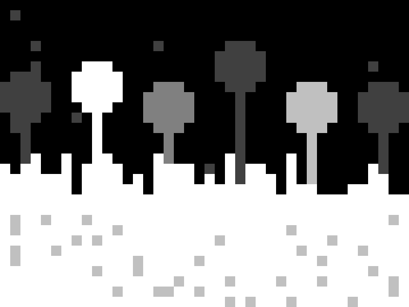
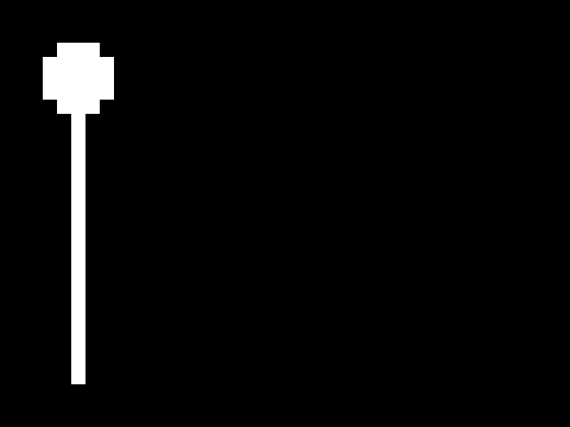

# Programming a View

This chapter is somehow an example for the functions chapter. In this chapter we will create a very simple world generator. As you have played with 2D games. There are always worlds. So let’s create world ourselves like this:  

 

 

As you see in the image, our world has a surface, some trees, stars, and rock under it’s surface, So how to implement all of them? Let’s code!

   
## Where to start?
If you look closely you see **4** four different **layers**. The back layer is the **Stars**, and then **tress**, **ground** and the most front layer **rocks**. That’s why we start with stars. So we need a `!drawStars(number)` function. Let’s create it.

  
### !drawStars(number)
So our first function is `!drawStars(number)` this function draws `@number` times of stars so like `!drawStarts(20)` draws `20` stars, So we have to first implement the `@number` in our header and then set the color to `#n = 3` then print stars.

Something you should know is half of the screen is going to be under the *surface layer* so we don’t need to draw stars there. All we have to do is to draw stars for the half of the screen:

<!-- CLIFF HIGHLIGHTER 0.02 DEV GENERATED CODE BLOCK--> 

<pre style="font-family: Monospace;">
<&nbsp;number&nbsp;>  //&nbsp;Setting&nbsp;#n&nbsp;to&nbsp;3 &nbsp;&nbsp;&nbsp;nnn  //&nbsp;Printing&nbsp;50&nbsp;dots &nbsp;&nbsp;&nbsp;[&nbsp;@number&nbsp;, &nbsp;&nbsp;&nbsp;&nbsp;&nbsp;&nbsp;[&nbsp;#i&nbsp;&nbsp;#rnd&nbsp;,&nbsp;r&nbsp;] &nbsp;&nbsp;&nbsp;&nbsp;&nbsp;&nbsp;[&nbsp;#j&nbsp;&nbsp;#rnd&nbsp;2&nbsp;,&nbsp;d&nbsp;] &nbsp;&nbsp;&nbsp;&nbsp;&nbsp;&nbsp;pi &nbsp;&nbsp;&nbsp;]  //&nbsp;done </pre>

<!-- CLIFF HIGHLIGHTER 0.02 DEV GENERATED CODE BLOCK--> 

Now what we need is to have a way to create trees…

  
### !drawTree()
So we need to create a few trees so we need to program a tree on a function and then use the func to have create trees as much as we need. A tree should look like this. And remember we need a long trunk for it because we will generate it with random heights and when we do so we need the trunk to be so long to still be covered by the surface. So a trunk will look like this:  

 

 

To create this tree we have to write this very simple function:  

<!-- CLIFF HIGHLIGHTER 0.02 DEV GENERATED CODE BLOCK--> 

<pre style="font-family: Monospace;">
<> [&nbsp;3&nbsp;,&nbsp;rp&nbsp;]&nbsp;rd  [&nbsp;3&nbsp;, &nbsp;&nbsp;&nbsp;[&nbsp;5&nbsp;,&nbsp;pl&nbsp;] &nbsp;&nbsp;&nbsp;[&nbsp;5&nbsp;,&nbsp;r&nbsp;] &nbsp;&nbsp;&nbsp;d ]  [&nbsp;3&nbsp;,&nbsp;lp&nbsp;]&nbsp;r [&nbsp;20&nbsp;,&nbsp;pd&nbsp;] </pre>

<!-- CLIFF HIGHLIGHTER 0.02 DEV GENERATED CODE BLOCK--> 

So now that we have two of our functions ready let’s implement them to the our main blueprint. So I’ll name the main blueprint `world.arendelle` At the first of the app we will need maybe 50 stars so I start the file with this:

<!-- CLIFF HIGHLIGHTER 0.01 DEV GENERATED CODE BLOCK-->

!drawStars(50)

<!-- CLIFF HIGHLIGHTER 0.01 DEV GENERATED CODE BLOCK-->

And now I need to put random trees in the page. How can I do that? look at this:  

 

 

Also we render them randomly between 1 to 7 dot in the height. So let’s look how my code does that:

<!-- CLIFF HIGHLIGHTER 0.02 DEV GENERATED CODE BLOCK--> 

<pre style="font-family: Monospace;">
!drawStars(50)  //&nbsp;Trees  &nbsp;&nbsp;&nbsp;(&nbsp;spacing&nbsp;,&nbsp;0&nbsp;)  &nbsp;&nbsp;&nbsp;[&nbsp;#i&nbsp;3,  &nbsp;&nbsp;&nbsp;&nbsp;&nbsp;&nbsp;i  &nbsp;&nbsp;&nbsp;&nbsp;&nbsp;&nbsp;//&nbsp;we&nbsp;set&nbsp;a&nbsp;random&nbsp;color &nbsp;&nbsp;&nbsp;&nbsp;&nbsp;&nbsp;&nbsp;&nbsp;&nbsp;[&nbsp;#rnd&nbsp;&nbsp;4&nbsp;,&nbsp;n&nbsp;]  &nbsp;&nbsp;&nbsp;&nbsp;&nbsp;&nbsp;//&nbsp;random&nbsp;height &nbsp;&nbsp;&nbsp;&nbsp;&nbsp;&nbsp;&nbsp;&nbsp;&nbsp;[&nbsp;&nbsp;(&nbsp;#rnd&nbsp;&nbsp;-7&nbsp;)&nbsp;-&nbsp;5&nbsp;+&nbsp;#j&nbsp;2&nbsp;,&nbsp;d&nbsp;]  &nbsp;&nbsp;&nbsp;&nbsp;&nbsp;&nbsp;//&nbsp;and&nbsp;we&nbsp;keep&nbsp;where&nbsp;we&nbsp;are&nbsp;using &nbsp;&nbsp;&nbsp;&nbsp;&nbsp;&nbsp;//&nbsp;@spacing,&nbsp;This&nbsp;way&nbsp;we&nbsp;can&nbsp;count &nbsp;&nbsp;&nbsp;&nbsp;&nbsp;&nbsp;//&nbsp;how&nbsp;many&nbsp;6&nbsp;dot&nbsp;should&nbsp;we&nbsp;add  &nbsp;&nbsp;&nbsp;&nbsp;&nbsp;&nbsp;&nbsp;&nbsp;&nbsp;[&nbsp;@spacing&nbsp;,&nbsp;r&nbsp;]  &nbsp;&nbsp;&nbsp;&nbsp;&nbsp;&nbsp;!drawTree&nbsp;()  &nbsp;&nbsp;&nbsp;&nbsp;&nbsp;&nbsp;//&nbsp;6&nbsp;dot&nbsp;is&nbsp;not&nbsp;the&nbsp;real &nbsp;&nbsp;&nbsp;&nbsp;&nbsp;&nbsp;//&nbsp;displacement&nbsp;but&nbsp;the&nbsp;7&nbsp;is&nbsp;look &nbsp;&nbsp;&nbsp;&nbsp;&nbsp;&nbsp;//&nbsp;at&nbsp;the&nbsp;image&nbsp;and&nbsp;you&nbsp;see&nbsp;why &nbsp;&nbsp;&nbsp;&nbsp;&nbsp;&nbsp;&nbsp;&nbsp;&nbsp;(&nbsp;spacing&nbsp;,&nbsp;+&nbsp;7&nbsp;) &nbsp;&nbsp;&nbsp;]</pre>

<!-- CLIFF HIGHLIGHTER 0.02 DEV GENERATED CODE BLOCK--> 

  
### !drawGround()
The ground is easy. We create some lines with a random difference in height like this:

<!-- CLIFF HIGHLIGHTER 0.02 DEV GENERATED CODE BLOCK--> 

<pre style="font-family: Monospace;">
<> &nbsp;&nbsp;&nbsp;(&nbsp;col&nbsp;,&nbsp;0&nbsp;)  &nbsp;&nbsp;&nbsp;[&nbsp;#n&nbsp;>&nbsp;0&nbsp;,&nbsp;n&nbsp;]  &nbsp;&nbsp;&nbsp;[&nbsp;#i&nbsp;,  &nbsp;&nbsp;&nbsp;&nbsp;&nbsp;&nbsp;i&nbsp;[&nbsp;@col&nbsp;,&nbsp;r&nbsp;]  &nbsp;&nbsp;&nbsp;&nbsp;&nbsp;&nbsp;[&nbsp;#rnd&nbsp;*&nbsp;5&nbsp;+&nbsp;#j&nbsp;2&nbsp;,&nbsp;d&nbsp;] &nbsp;&nbsp;&nbsp;&nbsp;&nbsp;&nbsp;[&nbsp;#j&nbsp;,&nbsp;pd&nbsp;]  &nbsp;&nbsp;&nbsp;&nbsp;&nbsp;&nbsp;(&nbsp;col&nbsp;,&nbsp;+1&nbsp;)  &nbsp;&nbsp;&nbsp;]  &nbsp;&nbsp;&nbsp;n</pre>

<!-- CLIFF HIGHLIGHTER 0.02 DEV GENERATED CODE BLOCK--> 

  
### !drawRocks()
We have to put some random dots like the way we did it in the `!drawStart(number)` but this time the other half of the screen. So:

<!-- CLIFF HIGHLIGHTER 0.02 DEV GENERATED CODE BLOCK--> 

<pre style="font-family: Monospace;">
<>  (&nbsp;col&nbsp;,&nbsp;1&nbsp;)  [&nbsp;#width&nbsp;3&nbsp;-&nbsp;1&nbsp;,  &nbsp;&nbsp;&nbsp;i&nbsp;[&nbsp;@col&nbsp;,&nbsp;r&nbsp;]  &nbsp;&nbsp;&nbsp;[&nbsp;#j&nbsp;2&nbsp;+&nbsp;6&nbsp;+&nbsp;#rnd&nbsp;&nbsp;4&nbsp;,&nbsp;d&nbsp;]  &nbsp;&nbsp;&nbsp;[&nbsp;#rnd&nbsp;&nbsp;10&nbsp;,&nbsp;d&nbsp;]&nbsp;p  &nbsp;&nbsp;&nbsp;(&nbsp;col&nbsp;,&nbsp;+&nbsp;3&nbsp;+&nbsp;#rnd&nbsp;*&nbsp;2&nbsp;)  ]</pre>

<!-- CLIFF HIGHLIGHTER 0.02 DEV GENERATED CODE BLOCK--> 

And we need to draw this rocks for quite a few times to be sure it happens cool so we add it to the main code with a loop: `[ 4 , !drawRocks() ]`

  
## And it’s done!
You see the app is ready! You should have this main blueprint by now:

<!-- CLIFF HIGHLIGHTER 0.02 DEV GENERATED CODE BLOCK--> 

<pre style="font-family: Monospace;">
!drawStars(50)  //&nbsp;Trees  &nbsp;&nbsp;&nbsp;(&nbsp;spacing&nbsp;,&nbsp;0&nbsp;)  &nbsp;&nbsp;&nbsp;[&nbsp;#i&nbsp;3,  &nbsp;&nbsp;&nbsp;&nbsp;&nbsp;&nbsp;i  &nbsp;&nbsp;&nbsp;&nbsp;&nbsp;&nbsp;//&nbsp;we&nbsp;set&nbsp;a&nbsp;random&nbsp;color &nbsp;&nbsp;&nbsp;&nbsp;&nbsp;&nbsp;&nbsp;&nbsp;&nbsp;[&nbsp;#rnd&nbsp;&nbsp;4&nbsp;,&nbsp;n&nbsp;]  &nbsp;&nbsp;&nbsp;&nbsp;&nbsp;&nbsp;//&nbsp;random&nbsp;height &nbsp;&nbsp;&nbsp;&nbsp;&nbsp;&nbsp;&nbsp;&nbsp;&nbsp;[&nbsp;&nbsp;(&nbsp;#rnd&nbsp;&nbsp;-7&nbsp;)&nbsp;-&nbsp;5&nbsp;+&nbsp;#j&nbsp;2&nbsp;,&nbsp;d&nbsp;]  &nbsp;&nbsp;&nbsp;&nbsp;&nbsp;&nbsp;//&nbsp;and&nbsp;we&nbsp;keep&nbsp;where&nbsp;we&nbsp;are&nbsp;using &nbsp;&nbsp;&nbsp;&nbsp;&nbsp;&nbsp;//&nbsp;@spacing,&nbsp;This&nbsp;way&nbsp;we&nbsp;can&nbsp;count &nbsp;&nbsp;&nbsp;&nbsp;&nbsp;&nbsp;//&nbsp;how&nbsp;many&nbsp;6&nbsp;dot&nbsp;should&nbsp;we&nbsp;add  &nbsp;&nbsp;&nbsp;&nbsp;&nbsp;&nbsp;&nbsp;&nbsp;&nbsp;[&nbsp;@spacing&nbsp;,&nbsp;r&nbsp;]  &nbsp;&nbsp;&nbsp;&nbsp;&nbsp;&nbsp;!drawTree&nbsp;()  &nbsp;&nbsp;&nbsp;&nbsp;&nbsp;&nbsp;//&nbsp;6&nbsp;dot&nbsp;is&nbsp;not&nbsp;the&nbsp;real &nbsp;&nbsp;&nbsp;&nbsp;&nbsp;&nbsp;//&nbsp;displacement&nbsp;but&nbsp;the&nbsp;7&nbsp;is&nbsp;look &nbsp;&nbsp;&nbsp;&nbsp;&nbsp;&nbsp;//&nbsp;at&nbsp;the&nbsp;image&nbsp;and&nbsp;you&nbsp;see&nbsp;why &nbsp;&nbsp;&nbsp;&nbsp;&nbsp;&nbsp;&nbsp;&nbsp;&nbsp;(&nbsp;spacing&nbsp;,&nbsp;+&nbsp;7&nbsp;) &nbsp;&nbsp;&nbsp;]  //&nbsp;Ground &nbsp;&nbsp;&nbsp;!drawGround()  //&nbsp;Rocks &nbsp;&nbsp;&nbsp;[&nbsp;4&nbsp;,&nbsp;!drawRocks()&nbsp;]  //&nbsp;done </pre>

<!-- CLIFF HIGHLIGHTER 0.02 DEV GENERATED CODE BLOCK--> 

So run it and see your world!

  

<h4>Exercise</h4>
Add functions to draw birds, clouds and a sun to the world!

