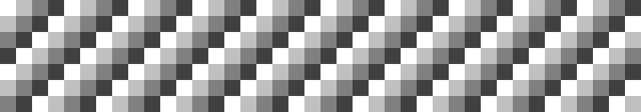
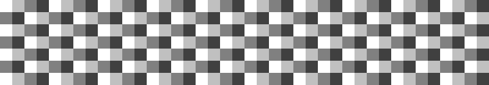

# Sources

## A bit more of loops

What are resources? Before learning about those resource or source or references or whatever me or others call them, let's learn a bit more about our friend loop! Loop is a good fella and we need to know him a bit more. 

Loop is compatible of great stuff such as handling different tasks. Tasks other languages have special grammars for each of them but here in the Arendelle our dear Loops smart enough to figure it out how to handle all of them. 

To see one of these great superhero capabilities of loop I should say I lied when introduced you the loop rule! The real rule is:

 

<!-- CLIFF HIGHLIGHTER 0.01 DEV GENERATED CODE BLOCK--> 
<pre style="font-family: Monospace;">
[&nbsp;Mathematical&nbsp;Expression&nbsp;,&nbsp;Code&nbsp;]&nbsp;</pre>

<!-- CLIFF HIGHLIGHTER 0.01 DEV GENERATED CODE BLOCK-->  

And by mathematical expression I mean something like `2 * 3 + 1`. (It's my most favorite expression! I don't know why but I always use it as my example and unfortunately you'll be seeing this one every where in this book and when I speak!) However, you can write a loop like this:

 

<!-- CLIFF HIGHLIGHTER 0.01 DEV GENERATED CODE BLOCK--> 
<pre style="font-family: Monospace;">
[&nbsp;2&nbsp;*&nbsp;3&nbsp;+&nbsp;1&nbsp;,&nbsp;pr&nbsp;]&nbsp;</pre>

<!-- CLIFF HIGHLIGHTER 0.01 DEV GENERATED CODE BLOCK-->  

And it just works perfect! Now let's talk about our dear Sources!

  
## Sources
What are these sources we're talking about so much? Let's say they are just like numbers! You can divide them or add them to numbers. You can do all things you can do with numbers with them but what are them that we can do all of these with? 

Imagine you're going to write a software (serious software) and many people with many different systems want using it. Your software's job is to create a line in size of your screen's width you can launch your Arendelle tool and it always says what is your screen size and so most of the times it's 23 so your awesome record breaking software will be:

 

<!-- CLIFF HIGHLIGHTER 0.01 DEV GENERATED CODE BLOCK--> 
<pre style="font-family: Monospace;">
[&nbsp;23&nbsp;,&nbsp;pr&nbsp;]&nbsp;</pre>

<!-- CLIFF HIGHLIGHTER 0.01 DEV GENERATED CODE BLOCK--> 

Not imagine if there a user change the screen size.... BOOM!!! The software will still make a line in size of 23 and that's where people realize their not going to pay you for the software anymore and your world wide fame will disappear next morning and you fail! 

That's bad and it's obvious that nobody wants that! We don't exactly know who but there was a very gifted man who could have see the future and he knew we're going to fail to write that software so he invented something guess what! Who am I kidding? It's obvious! That was the Sources! Actually they were not sources, I created sources, but there was this idea that was invented and it was to create something like a word that represents screen size or something else like that 

As in algebra you write words and read them as numbers like when you say let `x` be 2 and then you can use `x` as 2 and write `x + 5 = 7` you can see sources this way too! 

Sources are words or sometimes letters that comes with an `#` in their start so something like `#source` can be a source but some stuff like `source` or `#    source` can not. This words we write represent an actual number like the screen size. 

Arendelle reads your expressions and if it finds any source it replaces them with the data they are representing for example we have this source for screen width witch is `#width`, By using it on our previews software we'll have something like this:

<!-- CLIFF HIGHLIGHTER 0.01 DEV GENERATED CODE BLOCK--> 
<pre style="font-family: Monospace;">
[&nbsp;#width&nbsp;,&nbsp;pr&nbsp;]&nbsp;</pre>

<!-- CLIFF HIGHLIGHTER 0.01 DEV GENERATED CODE BLOCK--> 

Sources are one of our most used tools in Arendelle because screen sizes are always different we will write our blueprint in a way that best matches the screen. Now, that you know about `#width` let’s get to know one other source:

| Name              | What they return      |
|:------------------|:----------------------|
| `#i` or `#width`  | Width of the screen   |
| `#j` or `#height` | Height of the screen  |

  
## Let's Code!

Have ever wanted to paint all the screen? Look at this code:

<!-- CLIFF HIGHLIGHTER 0.01 DEV GENERATED CODE BLOCK--> 
<pre style="font-family: Monospace;">
[&nbsp;#j&nbsp;,  &nbsp;&nbsp;&nbsp;&nbsp;[&nbsp;#i&nbsp;,&nbsp;pr&nbsp;]&nbsp; &nbsp;&nbsp;&nbsp;&nbsp;[&nbsp;#i&nbsp;,&nbsp;l&nbsp;]&nbsp; &nbsp;&nbsp;&nbsp;&nbsp;d &nbsp;&nbsp;&nbsp; ]&nbsp;</pre>

<!-- CLIFF HIGHLIGHTER 0.01 DEV GENERATED CODE BLOCK--> 

This code does the job right? Now let's do something fun! Look at this code:

<!-- CLIFF HIGHLIGHTER 0.01 DEV GENERATED CODE BLOCK--> 
<pre style="font-family: Monospace;">
[&nbsp;#j&nbsp;,  &nbsp;&nbsp;&nbsp;&nbsp;[&nbsp;#i&nbsp;,&nbsp;pnr&nbsp;]&nbsp; &nbsp;&nbsp;&nbsp;&nbsp;[&nbsp;#i&nbsp;,&nbsp;l&nbsp;]&nbsp; &nbsp;&nbsp;&nbsp;&nbsp;dn &nbsp;&nbsp;&nbsp; ]&nbsp;</pre>

<!-- CLIFF HIGHLIGHTER 0.01 DEV GENERATED CODE BLOCK--> 

This will result like this:

 

 

Now if you after one more `n` after `dn` this way:

 

<!-- CLIFF HIGHLIGHTER 0.01 DEV GENERATED CODE BLOCK--> 
<pre style="font-family: Monospace;">
[&nbsp;#j&nbsp;,  &nbsp;&nbsp;&nbsp;&nbsp;[&nbsp;#i&nbsp;,&nbsp;pnr&nbsp;]&nbsp; &nbsp;&nbsp;&nbsp;&nbsp;[&nbsp;#i&nbsp;,&nbsp;l&nbsp;]&nbsp; &nbsp;&nbsp;&nbsp;&nbsp;dnn &nbsp;&nbsp;&nbsp; ]&nbsp; </pre>

<!-- CLIFF HIGHLIGHTER 0.01 DEV GENERATED CODE BLOCK--> 

The result will be:

 

 

  
## Good for now!
There are many important sources you will learn soon. However, you will use `#i` and `#j` more than any of them. As it seems you know enough about sources let’s go to the next chapters and then play with sources in a higher level!
