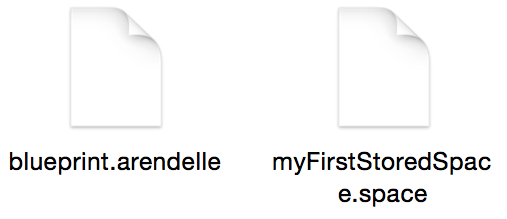
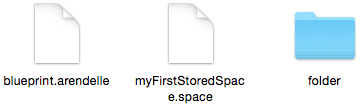
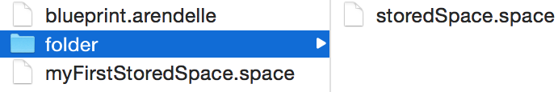

# Stored Spaces

With Spaces you now can keep information in your app. However, when you exit the app… Its done! You’re information is dead! And you can’t do anything about it! You may wonder… When you open your computer it remembers your name and password! When you open your note apps all your notes are there… But how? It’s easy! We have two memories. As we have walked through this in the **Spaces** chapter we know what this two memories are . Actually as I’m typing this on January 2nd 2015 in the HP company the researchers are working on a new computer with one type of memory that does the both ( If its year 2200 and you’re still reading this book I’m sure you’re laughing… *“How could they use two memories! Why they even needed memories?? ha ha! their stuff used electricity! How old of them! WOW!”* - I’m not sure if you still use wow in 2200’s so forgive me).

However, in Arendelle you have two kind of spaces. One is called **Space** and the other is called **Stored Space**. You know spaces, but you most certainly don’t know about Stored Spaces. When you create a stored space. Arendelle never keeps it in it’s short memory. Arendelle saves it as a file with **.space** format. So are you ready? We learn it very soon! Maybe in less than a second...

  
## Arendelle File System
To create a stored space we use our good old space grammar with only one simple difference:

<!-- CLIFF HIGHLIGHTER 0.01 DEV GENERATED CODE BLOCK-->

<pre style="font-family: Monospace;">
(&nbsp;$arendellePath&nbsp;,&nbsp;expression&nbsp;)&nbsp;</pre>

<!-- CLIFF HIGHLIGHTER 0.01 DEV GENERATED CODE BLOCK-->

So in the past you used `#` to call a source, `@` to call a space and from now on you’ll use `$` to call a stored space. Before this, we used no `@` in the space grammar because the space grammar itself knew it’s a space! However to make the space grammar understand that you’re editing not a regular space but a **stored** space. You have to use the `$` on the stored space’s name like :

<!-- CLIFF HIGHLIGHTER 0.01 DEV GENERATED CODE BLOCK-->

<pre style="font-family: Monospace;">
(&nbsp;$storedSpace&nbsp;,&nbsp;10&nbsp;)&nbsp;</pre>

<!-- CLIFF HIGHLIGHTER 0.01 DEV GENERATED CODE BLOCK-->

But what happens when you do so? Where our `$storedSpace` saved? Every Arendelle blueprint is a file right? If you create an Arendelle blueprint and name it: `blueprint.arendelle` and write the following code on it:

<!-- CLIFF HIGHLIGHTER 0.01 DEV GENERATED CODE BLOCK-->

<pre style="font-family: Monospace;">
(&nbsp;$myFirstStoredSpace&nbsp;,&nbsp;10&nbsp;)&nbsp;</pre>

<!-- CLIFF HIGHLIGHTER 0.01 DEV GENERATED CODE BLOCK-->

And you put it in a folder like this:

</img>
 

Now if you run the code and check out the folder again you will see this:

 
</img>
 

Yes, As you see now you have a new file called `myFirstStoredSpace.space` in the same folder as your `blueprint.arendelle`. So you know that the file name will always be the the stored space’s name.

So you can now use your stored space like this:

<!-- CLIFF HIGHLIGHTER 0.01 DEV GENERATED CODE BLOCK-->

<pre style="font-family: Monospace;">
[&nbsp;$myFirstStoredSpace&nbsp;,&nbsp;pr&nbsp;]&nbsp;</pre>

<!-- CLIFF HIGHLIGHTER 0.01 DEV GENERATED CODE BLOCK-->

However, you should know that each time you call the `$myFirstStoredSpace`, Arendelle loads it from your file not it’s memory and it’s fast enough that you don’t have to worry about it. But something cool is you can create a folder in the directory you have your `blueprint.arendelle` on it and then this way to access that folder. Imagine this:

 

</img>
 
 

To save a stored space in the our `folder` directory we should use Arendelle File System. In Arendelle, the folder that your main blueprint is on it is the root folder. When you use `$stored` the `stored.space` file will be saved in the same folder as your main `blueprint.arendelle` file. so now if you put the `folder` on this folder like the image. You should use prepend your `$stored` with the `folder.` to save the `stored.space` to the folder. Imagine you’re going to save the `storedSpace.space` on the `folder` you should write this code:

<!-- CLIFF HIGHLIGHTER 0.01 DEV GENERATED CODE BLOCK-->

<pre style="font-family: Monospace;">
(&nbsp;$folder.storedSpace&nbsp;,&nbsp;10&nbsp;)</pre>

<!-- CLIFF HIGHLIGHTER 0.01 DEV GENERATED CODE BLOCK-->

As you know this system works like this:

 

</img>

  
The dot in this stored space name is called **Path Separator** which is used to make directories. What you write in the right side of the Path Separator is a file or folder in the folder that you create in the left side of the Path Separator. So when you write `folder1.folder2.file` the `file` is in the `folder2` and `folder2` is in the `folder1`.

So if we change the code of our `blueprint.arendelle` to this:

<!-- CLIFF HIGHLIGHTER 0.01 DEV GENERATED CODE BLOCK-->

<pre style="font-family: Monospace;">
(&nbsp;$folder.storedSpace&nbsp;,&nbsp;10&nbsp;)&nbsp;</pre>

<!-- CLIFF HIGHLIGHTER 0.01 DEV GENERATED CODE BLOCK-->

The result will be like this:

</img>

 

As you see we have the `storedSpace.space` saved on our `folder` directory. You can manage your spaces like this with folders. And remember that you have to create the folders yourself and Arendelle won’t create them for you.

  
## Where are we going with this?
Actually, you can do so much with stored spaces. But for me the important part of learning the stored spaces was to tech you the **Arendelle File System** which we’ll use in the next chapter: **Functions** and the Arendelle File System is so important there. So no exercise here, let’s just learn Functions!

